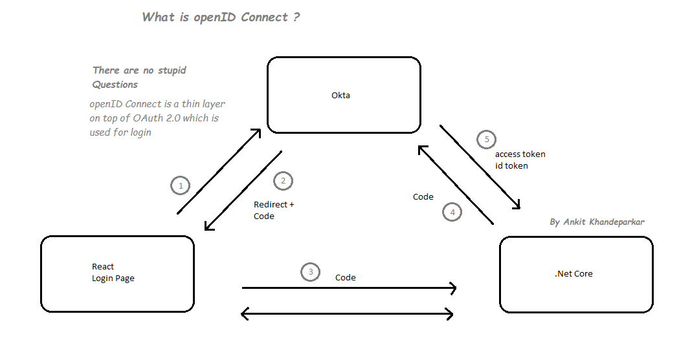
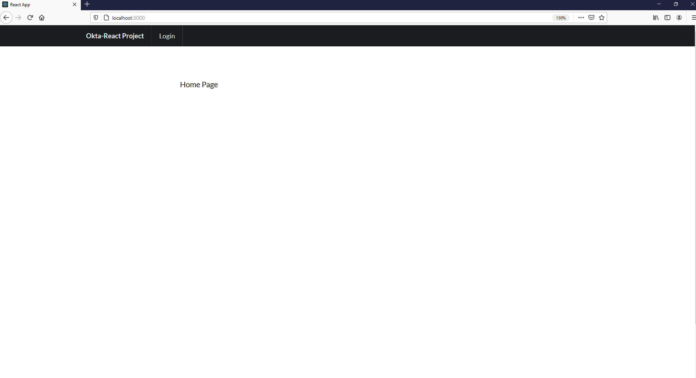
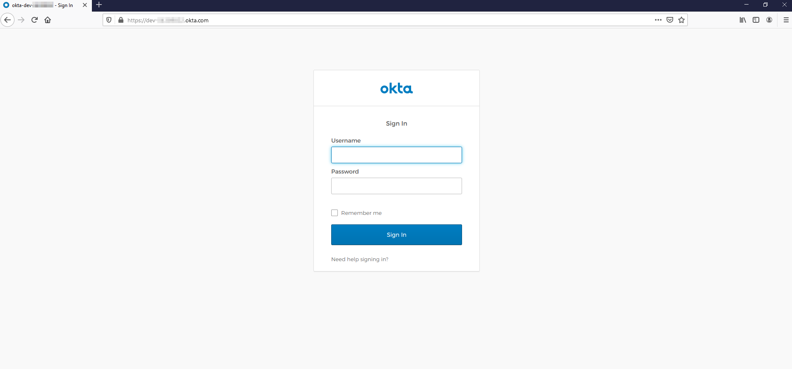
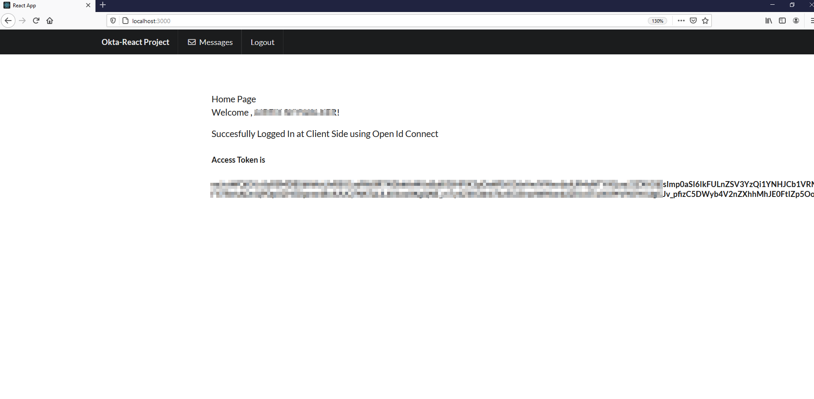
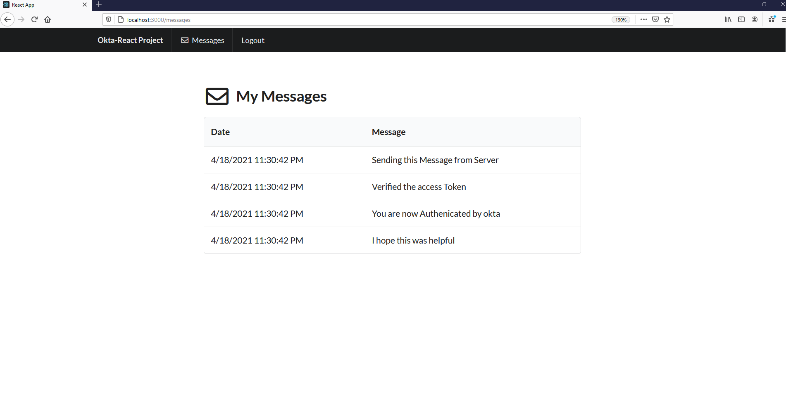

# okta-React-aspnetcore-webapi
Authentication using Okta with React as Client and aspnetcore as Server.

<h5>Brief about OpenID Connect</h5>

<h5>Home Page after React starts</h5>

 

<h5>After you click login Redirect to Okta login page</h5>

 

<h5>Home Page after login displays a token to sync with .net </h5>

 

<h5>Messages fetched from .net only if token is correct</h5>

